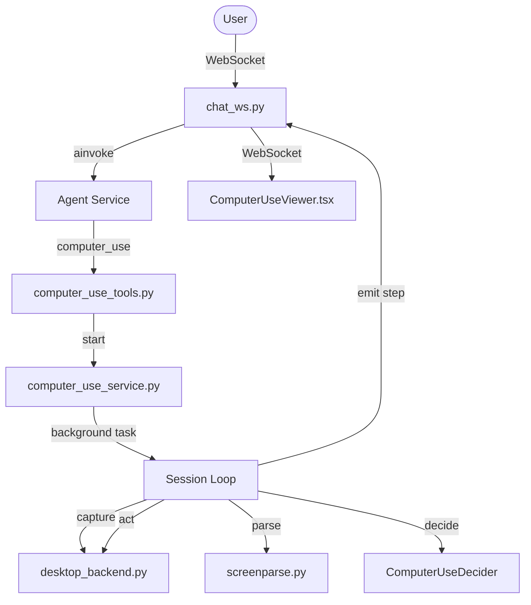

# Computer-Use (OmniParser v2) Implementation Report

This report summarizes the design decisions, architecture, and integration details for adding computer-use capabilities to the Shore Assistant.

## Architecture Overview

## 1. Coordinate Normalization & Mouse Clicks
Visual grounding models return bounding boxes and coordinates normalized to a `(0..1000, 0..1000)` grid.
- **Perception**: `ScreenParse` gRPC service detects elements on the primary display and outputs bounding box coordinates in `[ymin, xmin, ymax, xmax]` normalized to `[0, 1000]`.
- **Target Resolution**: The decider parses coordinates in `(0..1000, 0..1000)`.
- **Conversion**: The service uses `LocalDesktopBackend.norm_to_pixels(nx, ny)` to translate these normalized coordinates back to actual screen pixel offsets:
  $$x = \text{clamp}\left(\frac{nx}{1000.0} \times w, 0, w - 1\right)$$
  $$y = \text{clamp}\left(\frac{ny}{1000.0} \times h, 0, h - 1\right)$$
- **Clicks**: Clicks are targeted at the center of the bounding box of the element (e.g. using `center(xmin, ymin, xmax, ymax)`).

## 2. Session Loop & Concurrency Control
To ensure safety and resource conservation, only a single computer-use session can run at any given time.
- **Concurrency Guard**: `ComputerUseService` tracks active sessions using a private `self._active` boolean and an `asyncio.Lock()`. Calling `start()` when `self.active` is true returns `False` immediately, rejecting concurrent runs.
- **Background Task**: The session loop is launched as a background `asyncio` task. This permits the main agent loop to return immediately to the user, allowing speech playback (TTS) and chat progression while desktop automation runs.
- **Cancellation**:
  - Stopping a session calls `self.stop()`, which cancels the background task.
  - The loop catches `asyncio.CancelledError` to cleanly handle stopping, writing a final audit entry and sending a `stopped` state message to the frontend.
  - Timeout budgets (`settings.COMPUTER_USE_MAX_STEPS`) and invalid actions limits prevent infinite loops.

## 3. Schema & Decision Mapping
- **Action Schema**: Defined using Pydantic (`ComputerUseAction`). Actions include `click`, `hover`, `type`, `press` (hotkeys), `scroll` (up/down/left/right), and `wait` (settling delays).
- **Decision Engine**: `ComputerUseDecider` uses structured output payloads (`response_format` JSON schema) with Gemma-4 against `llama-server`.
- **Audit Logging**: Every action, screen state, parsed element, and decision is persisted to `data/computer_use_audit.log` as structured JSONL lines for post-hoc debugging.

## 4. Frontend Integration
- **WebSockets**: State changes (`computer_use_state`) and step updates (`computer_use_step`) are pushed in real-time over `/ws/chat`.
- **Viewer Component**: `ComputerUseViewer.tsx` renders the visual state of the session. It displays the annotated Set-of-Mark (SoM) image overlay returned by OmniParser, highlighting the targeted element and displaying the reason/status of the current step. It includes a "Stop" button to halt execution.
